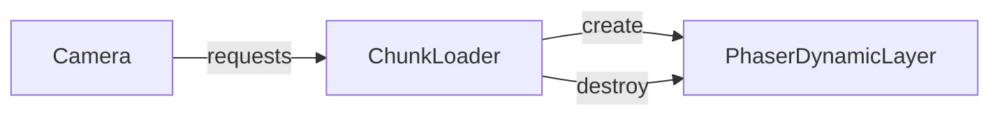

# Phased Implementation Plan (Vite + React + Phaser Infinite Map)

## Phase 0 — Foundation check
- **Lock versions**
  - React **19.1.0**
  - Vite **7.0**
  - Phaser **3.90.0**
- **Decide TypeScript vs. JavaScript**  
  Phaser’s official templates exist in both; TypeScript is recommended.

## Phase 1 — Project scaffolding
- `npm create vite@latest my-map -- --template react-ts`
- Pull the **phaserjs/template-react** starter pieces (`GameCanvas.tsx`, Vite config, HMR bridge).
- Add CI/CD boilerplate (GitHub Actions lint → test → build).
- **Exit criteria:** `pnpm dev` opens at `localhost:5173` and shows a blank React page.

## Phase 2 — Embed the Phaser game
- `pnpm add phaser` (plus `@ion-phaser/react` if you prefer declarative JSX).
- Implement `<GameCanvas>` hook that mounts **one** `new Phaser.Game()` and destroys on unmount.
- Add `PreloadScene` and `WorldScene` stubs.
- Ensure Vite hot‑refresh updates both the React tree and active Phaser scenes.

## Phase 3 — Infinite‑map engine
- Use `simplex-noise` to decide grass vs. water per tile.
- Generate **32×32**‑tile chunks; store in a `Map<string,Layer>` keyed by chunk coords.
- On every `update()` load chunks within an N‑chunk radius of the camera; evict those outside.
- Implement 4‑bit transition autotiling for seamless borders.

## Phase 4 — Performance & tooling
- Render with **DynamicTilemapLayer** (GPU‑batched; culls off‑screen tiles).
- Move terrain generation into a Web Worker.
- Code‑split large assets with Vite dynamic imports.
- Run a profiling pass (Chrome FPS meter, memory snapshots).

## Phase 5 — React UI & game systems
- **HUD in React:** FPS counter, minimap thumbnail, settings modal.
- **Gameplay in Phaser:** player movement, collisions, path‑finding.
- **State bridge:** event bus or Zustand store exposes summary data (score, health) to React.

## Phase 6 — Production build & deploy
- `vite build --mode production` → hashed chunks & ES modules.
- Add PWA/offline support via `@vite-pwa/plugin` if desired.
- Host on Netlify/Vercel/GH Pages; test infinite scroll on mobile browsers.

## Phase 7 — Post‑launch polish
- Instrument analytics (how far users roam).
- Add accessibility improvements (reduced‑motion, keyboard‑only nav).
- Optimise assets (WebP/AVIF, texture atlases).
- Track new Phaser and React minor releases for perf wins.

### Timeline at a glance

| Phase | Primary outcome |
|-------|-----------------|
| 0 | Version alignment |
| 1 | Vite + React project boots |
| 2 | Phaser canvas inside React shell |
| 3 | Procedurally infinite terrain |
| 4 | 60 fps target performance |
| 5 | Game HUD & core loop |
| 6 | Production build deployed |
| 7 | Continuous improvements |
